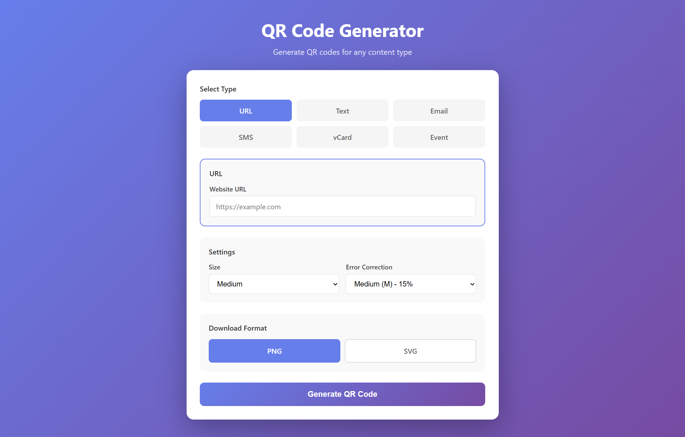

# QR Code Generator



A simple, modern QR code generator built with PHP and CSS. Generate QR codes for various content types including URLs, text, emails, SMS, vCards, and calendar events.

## Features

- Generate QR codes for multiple content types
- Download as PNG or SVG format
- Adjustable size and error correction level
- Clean, responsive UI
- Real-time form switching

## Supported Content Types

| Type | Description |
|------|-------------|
| URL | Website URLs |
| Text | Plain text |
| Email | Email with subject and body |
| SMS | Text message with phone number |
| vCard | Contact information |
| Event | Calendar event |

## Requirements

- PHP 8.0+
- Composer

## Installation

```bash
git clone <repository-url>
cd qr-code
composer install
```

## Usage

1. Select a content type from the menu
2. Fill in the required fields
3. Choose download format (PNG or SVG)
4. Click "Generate QR Code"
5. Preview your QR code
6. Download in your preferred format

## Technology Stack

- PHP 8.x
- CSS3
- JavaScript (for form switching)
- [chillerlan/php-qrcode](https://github.com/chillerlan/php-qrcode)

## License

MIT License

Copyright (c) 2024

Permission is hereby granted, free of charge, to any person obtaining a copy
of this software and associated documentation files (the "Software"), to deal
in the Software without restriction, including without limitation the rights
to use, copy, modify, merge, publish, distribute, sublicense, and/or sell
copies of the Software, and to permit persons to whom the Software is
furnished to do so, subject to the following conditions:

The above copyright notice and this permission notice shall be included in all
copies or substantial portions of the Software.

THE SOFTWARE IS PROVIDED "AS IS", WITHOUT WARRANTY OF ANY KIND, EXPRESS OR
IMPLIED, INCLUDING BUT NOT LIMITED TO THE WARRANTIES OF MERCHANTABILITY,
FITNESS FOR A PARTICULAR PURPOSE AND NONINFRINGEMENT. IN NO EVENT SHALL THE
AUTHORS OR COPYRIGHT HOLDERS BE LIABLE FOR ANY CLAIM, DAMAGES OR OTHER
LIABILITY, WHETHER IN AN ACTION OF CONTRACT, TORT OR OTHERWISE, ARISING FROM,
OUT OF OR IN CONNECTION WITH THE SOFTWARE OR THE USE OR OTHER DEALINGS IN THE
SOFTWARE.
